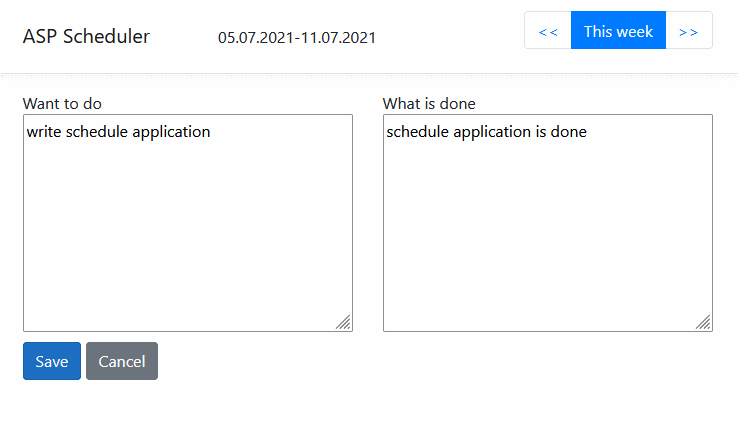

Simple week scheduler on ASP.NET Core.

Designed to create a weekly plan and report. The navigation buttons can be used to change a week.

Has simple architecture: one get handler (get week info) and one post handler (save week info).

Data are stored in xml format in application subfolder (one file for each week).
Require write permissions after publishing the application to IIS. 
